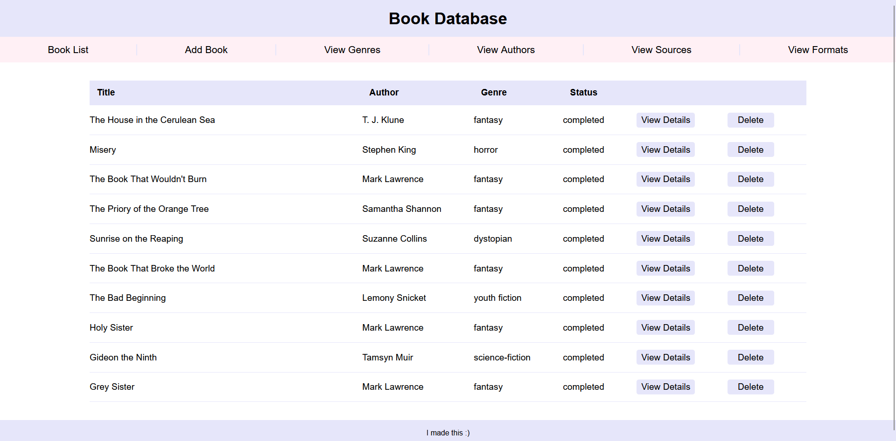

# Book Tracker

A PHP and MySQL web application for tracking personal reading. Built as a school project with a normalized relational database and a fully database-driven UI.

## Features

- Add, view, edit, and delete books with full details
- Track reading status, format, source, genre, and rating per book
- Dynamic dropdowns query the database at runtime — genre, author, format, source, and status options update automatically as the database changes, with nothing hardcoded
- Smart author lookup on book entry: searches for an existing match and associates it, or creates a new author record if none exists — no duplicate authors
- Modular header and footer templates shared across all pages via include files
- Filter and browse books by various attributes

## Database Schema

Six related tables connected via foreign keys: `books`, `authors`, `genres`, `formats`, `sources`, and `statuses`

The included SQL file can be used to recreate the full database structure and sample data.

## Setup

1. Clone the repository
2. Install [WAMP](https://www.wampserver.com/), [XAMPP](https://www.apachefriends.org/), or any local PHP/MySQL server
3. Import `books.sql` into MySQL to create the database and tables
4. Copy `database.example.php` to `database.php` and fill in your local credentials
5. Place the project folder in your server's web root (e.g. `www/` in WAMP)
6. Open `localhost/book-tracker` in your browser

## Built With

- PHP
- MySQL
- HTML / CSS
